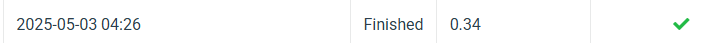

# NYCUCV2025HW3

<p>Student ID: 111550029</p>
<p>Name: 蔡奕庠</p>

## Introduction 

This project implements a cell instance segmentation system using the Mask R-CNN architecture. The system is capable of detecting and segmenting different types of cells in medical images. The main task involves:

* Identifying and segmenting 4 different cell types (class1, class2, class3, class4) in colored medical images
* Generating accurate instance masks for each cell
* Producing predictions in COCO format for evaluation

## How to install
Follow these steps to set up and run the project:

### 1. Clone the repository
```bash
git clone https://github.com/xingting1026/NYCUCV2025HW3.git
cd NYCUCV2025HW3
```

### 2. Create a virtual environment
```bash
conda create --name cell_seg python=3.9
conda activate cell_seg
```
### 3. Install dependencies
```bash
pip install -r requirements.txt
```

### 4. Set up your dataset
```bash
project_root/
│── hw3-data-release/
│   ├── train/
│   │   ├── [image_folder_1]/
│   │   │   ├── image.tif
│   │   │   ├── class1.tif
│   │   │   ├── class2.tif
│   │   │   └── ...
│   │   └── ...
│   ├── test_release/
│   │   ├── [image_1].tif
│   │   └── ...
│   └── test_image_name_to_ids.json
│── main.py
│── utils.py
│── requirements.txt
```
### 5. Run the main script
```bash
python main.py
```
## Performance snapshot
